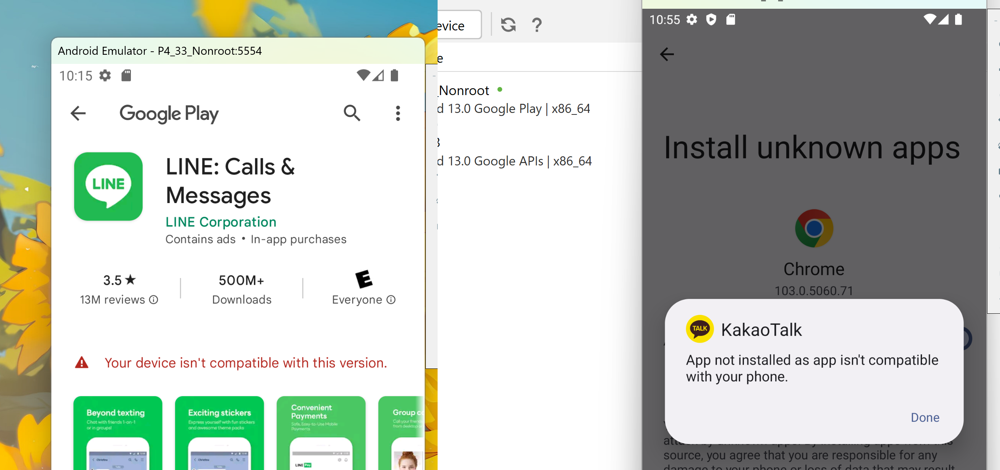
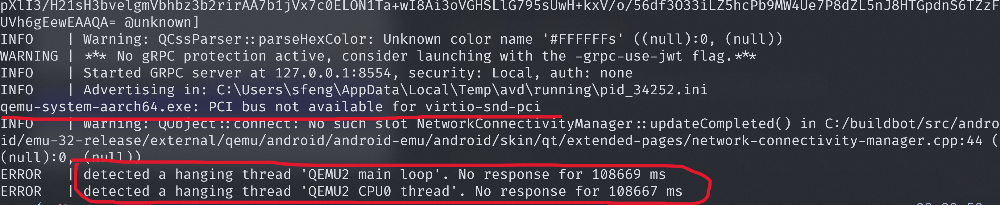
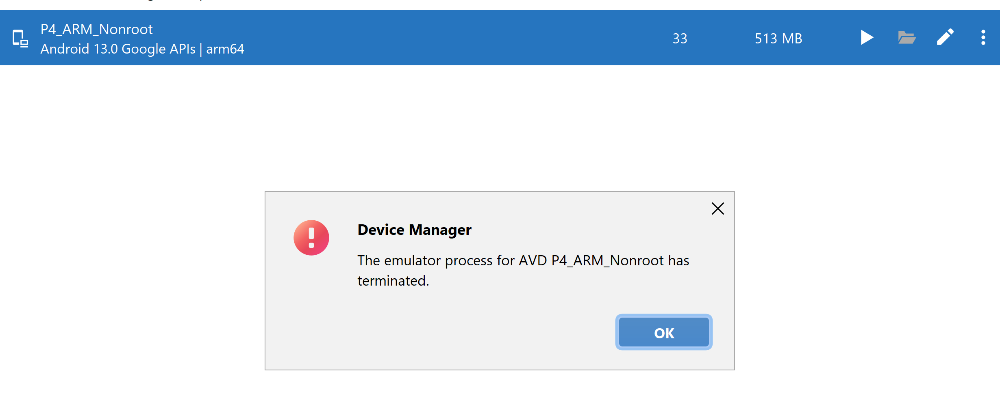

## Application Selection: Kakao, Line and Slack

June 2023, Shuo Feng, s.feng@dal.ca

### Candidates

| App   | Origin        | Main User Group             | Functionality                                                |
| ----- | ------------- | --------------------------- | ------------------------------------------------------------ |
| Kakao | South Korea   | Individuals in Asia.        | Instant messaging, voice calls, multimedia sharing.          |
| LINE  | Japan         | Diverse user group in Asia. | Instant messaging, voice/video calls, stickers, games.       |
| Slack | United States | Teams and organizations.    | Real-time messaging, channel organization, tool/service integrations. |

### Kakao Talk & Line

First, Kakao Talk and Line cannot run in the Android emulator because they do not offer x86 architecture installation files in any source (Google Play, Third-party app store etc.). 

In addition, I failed to create an ARM architecture environment, and the reason remains unknown. Possible causes are **missing drivers**, **upstream issues**, or **misconfiguration**.

In conclusion, I can investigate it further but cannot guarantee the final result.

### Slack

Both google play store and third-party versions work. 