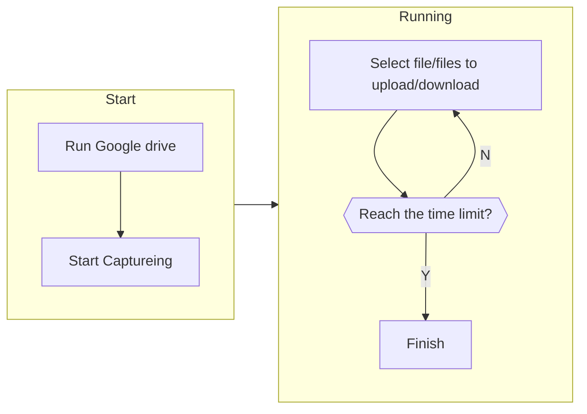

# USRA Weekly Meeting: May. 24, 2023

## Setup Environment

First time running:

Details: [Root AVDs Without Play Store](https://academic.sfeng.ca/blog/capture-avd-traffic-androiddump#root-avds-without-play-store)


Future running:

Details: [Postprocessing](https://academic.sfeng.ca/blog/capture-avd-traffic-androiddump#postprocessing)


## TikTok

### Original Process

The Android client does not have an autoplay function, so I write a [script](https://github.com/vonhyou/usra23-archive/blob/master/Scripts/auto_swipe.ps1) to swipe to the next video after a random time interval. 


### Revised Process

I will observe and capture traffic during the login process


### Google Chrome

Initially, I plan to open and close URLs using `adb`. However, google chrome does not have a certain [`intent`](https://developer.android.com/reference/android/content/Intent) to close a tab (I can open but cannot close), and no function to close all tabs when exiting. Therefore, I implement a [webpage](https://github.com/vonhyou/usra23-archive/tree/master/Web/open-close) using HTML/JavaScript to automate the process.


For the time interval, see: [SelectTimeIntervals.m](https://github.com/vonhyou/usra23-archive/blob/master/Matlab/SelectTimeIntervals/SelectTimeIntervals.m)

Sample output:


**Waiting for further instructions**

### Google Drive

I did not automate the uploading and downloading process because of its proprietary software nature. Moreover, I have restricted the uploading speed to 10Mbps and downloading to 40Mbps. Therefore, limited user operation is required.



My current issue is that I cannot upload a large archive (2GB), so I’ll adjust some of the files to the paper [10.1109/ICCISci.2019.8716385](https://ieeexplore.ieee.org/document/8716385). The final dataset is going to be:

```
photo-small: 3MB in total, 792 pictures
photo: 102MB in total, 17 pictures
photo-large: 112MB in total, 2 pictures

archive.zip: about 200MB
archive-large.zip: about 1000MB
```

The behaviour of uploading and downloading many small files is quite interesting. In the first round, uploading all 3MB photos takes longer than a 224MB single file.


**Waiting for further instructions**
